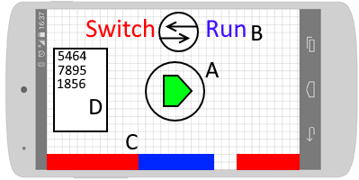

## Functioneel ontwerp

'Switch' is een endless runner waarbij de player zo ver mogelijk moet komen.
De speler heeft twee controls, sprinngen en 'switchen'. Door te springen 
kan de speler gaten in het level ontwijken. Met de switch functie kan de 
speler van dimensie wisselen. Hiermee kan de speler ook obstakels zoals 
muren die in een van de twee dimensies voorkomen ontwijken.

##### Power-ups

Er zitten een aantal power-ups in het spel. Een van deze power-ups is een shield,
waarmee de speler een keer tegen een muur aan kan lopen zonder dood te gaan. 
Mogelijke andere power-ups zijn slow-fall, high-jump, of het verminderen van de switch cooldown

### Voorbeeld menu

Dit is een voorbeeld van het menu dat de speler te zien krijgt als het spel opgestart wordt

 - A. De start knop. Als de speler hier op drukt zal het spel beginnen.
 - B. De titel en het logo.
 - C. Het level zal in de achtergrond aan het scrollen zijn zolang de speler in het menu zit
 - D. De highscores. Hier zullen alle hoogste scores die op deze telefoon gehaald zijn te zien zijn.

### Voorbeeld gameplay

Dit is een voorbeeld van wat de player ziet tijdens het spelen van de game.

- A. De player. Deze zal naar rechts blijven lopen, en springen wanneer 
de speler het commando hiervoor geeft.
- B. Een platform in de eerste dimensie. Deze is alleen zichtbaar wanneer de player zich in de eerste dimensie bevindt.
- C. Een platform in de tweede dimensie. Deze is alleen zichtbaar wanneer de player zich in de tweede dimensie bevindt.
- D. De score. Hier kan de speler zien hoe ver hij is gekomen.
- E. Een muur in de eerste dimensie. De player moet deze muur zien te ontwijken door van dimensie te wisselen.